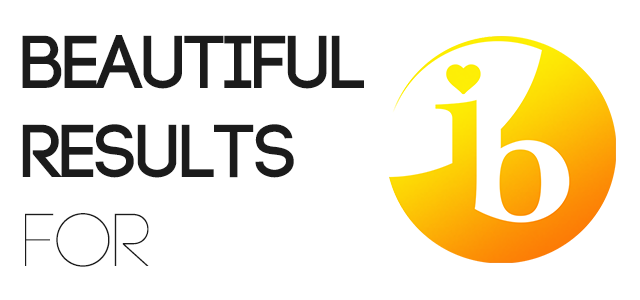

<h1 align="center">

</h1>

A browser extension that makes every IB result look beautiful!

# Download

The extension is available for both Chrome and Firefox. You can also build it yourself and load it as an unpacked extension.

> This work/product/service has been developed independently from and is not endorsed by the International Baccalaureate Organization. International Baccalaureate, Baccalauréat International, Bachillerato Internacional and IB are registered trademarks owned by the International Baccalaureate Organization
